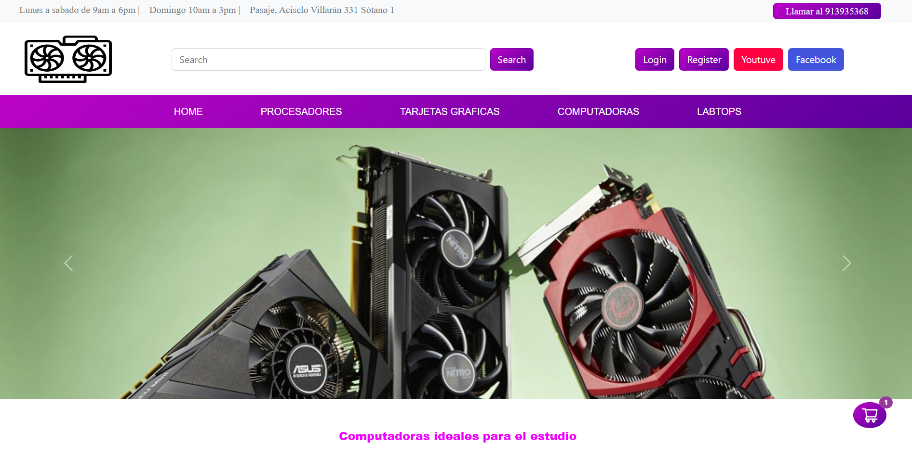
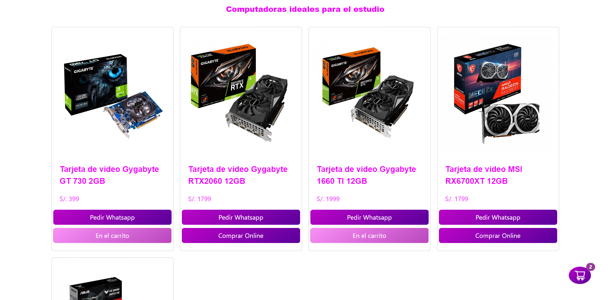
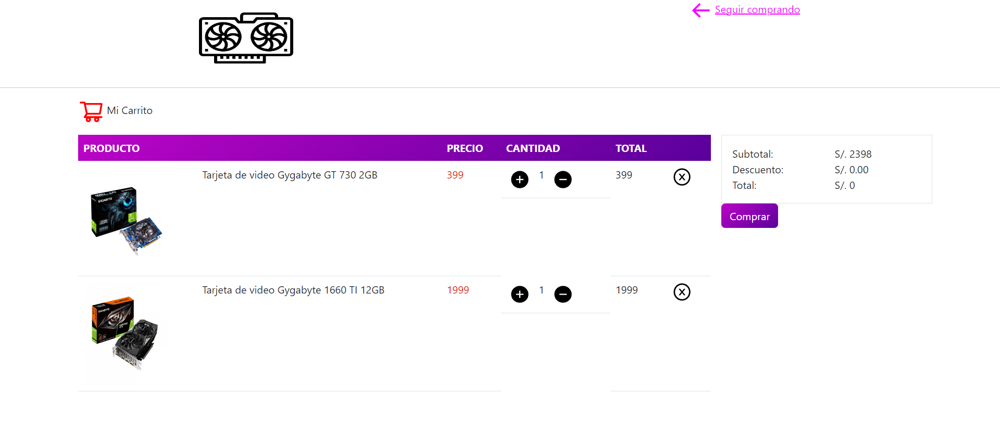

# AQPC - Arequipa PC  
It's a project made in React. It's about a web application to sell computer components
Este proyecto hecho en React, es acerca de una aplicación web para vender componentes de computadoras. El backend funciona por separada implementado en Flask. Esta parte del Frontend esta hecha usando React, React Router y Bootstrap.

En la aprte del index se llaman a los diferentes productos desde el backend

Luego estos son pasados cuando son seleccionados al carrito de compras
